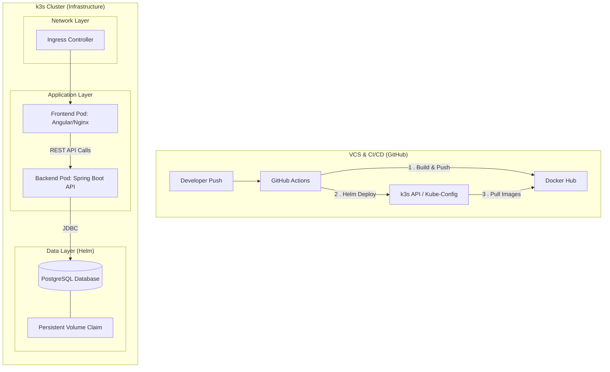

# Datascientest Final Project

## Step 1: Specifications

## Definition of Business Needs

### Project Overview

The objective of this project is the modernization and automation of the Spring Petclinic
application. Originally designed as a monolithic-style service, we transition it into a decoupled architecture to
demonstrate modern DevOps practices.

### Business Objectives

- **Operational Efficiency:** Provide a stable environment for managing veterinary data (owners, pets, visits).
- **Scalability:** Separate frontend and backend to allow independent scaling of components based on load.
- **Reliability:** Implement a persistent PostgreSQL database to replace volatile in-memory storage, ensuring data
  integrity for the clinic's records.
- **Automation:** Reduce manual deployment errors by implementing a full CI/CD pipeline.

### Application Components

- **Backend:** Java-based Spring Boot REST
  API ([petclinic-rest](https://github.com/spring-petclinic/spring-petclinic-rest)).
- **Frontend:** Angular-based web
  interface ([petclinic-angular](https://github.com/spring-petclinic/spring-petclinic-angular)).
- **Database:** PostgreSQL (replacing the default HSQL in-memory DB).

### Project Management & Methodology

- **Methodology:** We follow an Agile/Kanban approach to manage the project lifecycle.
- **Task Management:** Project tasks are defined as GitHub Issues.
- **Visualization:** A [GitHub Project Board](https://github.com/users/baris1892/projects/2) is used to track progress
  through 'To Do', 'In Progress', and 'Done'
  columns.
- **Milestones:** The project is structured into 6 major milestones corresponding to the Datascientest project phases.

## Implementation Diagram

The following diagram illustrates the "Path to Production" and the target architecture in the k3s cluster:

