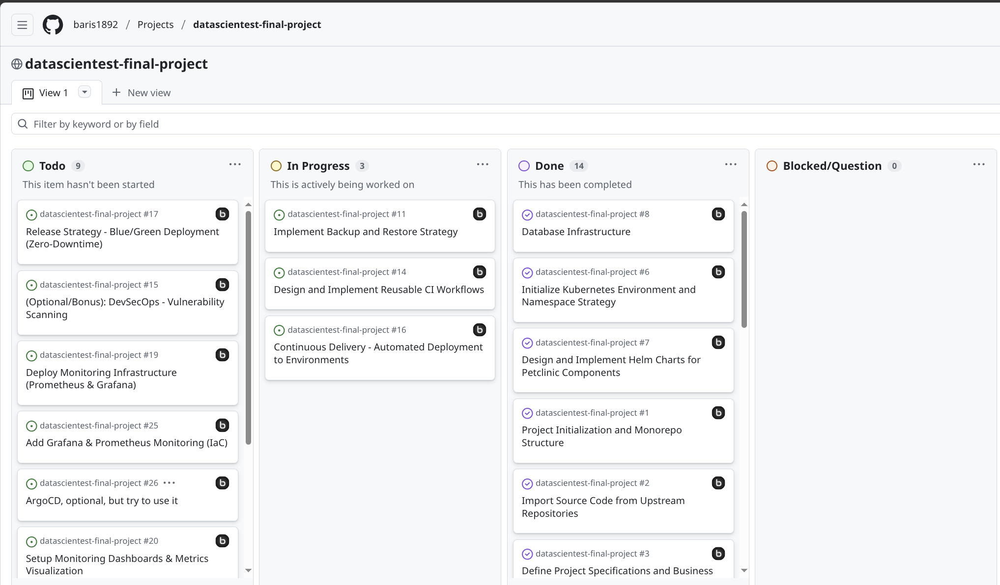
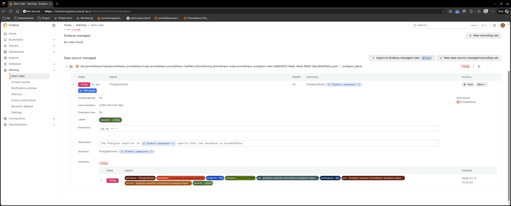
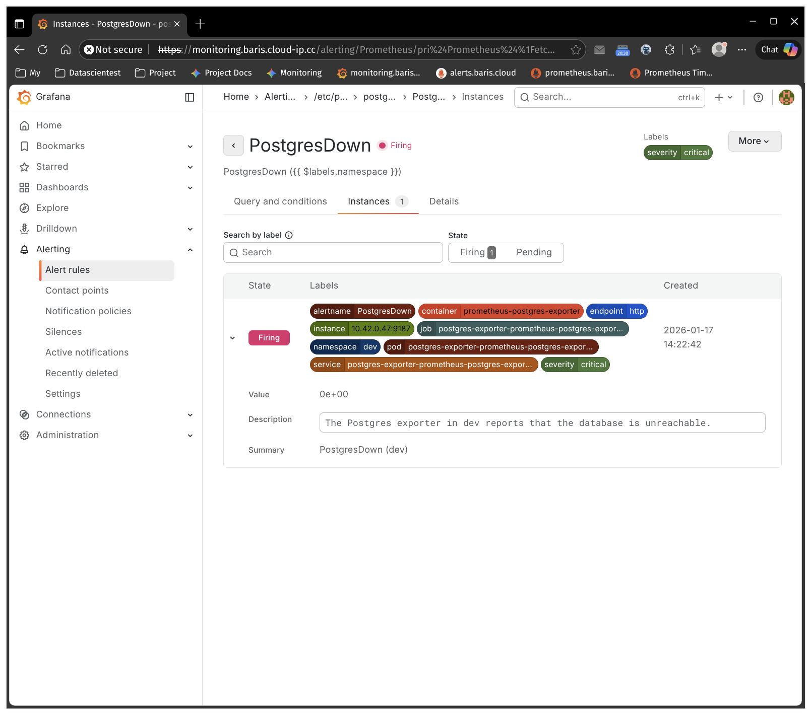

# Datascientest Final Project Documentation

## Contents

1. [Overview of the app](#1-overview-of-the-app)
2. [Architecture Diagram](#2-architecture-diagram)
3. [Tech Stack](#3-tech-stack)
4. [Setup Steps](#4-setup-steps)
5. [How to deploy dev & prod](#5-how-to-deploy-dev--prod)
6. [CI/CD](#6-cicd)
7. [Monitoring](#7-monitoring)
8. [Security](#8-security)
9. [Disaster Recovery](#9-disaster-recovery)

---

## 1. Overview of the app

The **Spring Petclinic** is a classic sample application designed to demonstrate the Spring Framework. In this project,
the application serves as the foundation for a modern, decoupled microservices architecture.

### Business & Technical Goals

- **Operational Efficiency:** Providing a stable environment to manage veterinary data (owners, pets and visits).
- **Modernization:** Transitioning from a monolithic-style service to a decoupled frontend-backend architecture.
- **Scalability & Reliability:** Enabling independent scaling of components and replacing volatile in-memory storage
  with a persistent **PostgreSQL** database to ensure data integrity.
- **Automation:** Implementing a full **CI/CD pipeline** to eliminate manual deployment errors and ensure rapid,
  reliable delivery.

### Core Components

- **Backend:** A Java Spring Boot REST API providing the business
  logic ([petclinic-rest](https://github.com/spring-petclinic/spring-petclinic-rest))
- **Frontend:** An Angular-based web interface for user
  interaction ([petclinic-angular](https://github.com/spring-petclinic/spring-petclinic-angular))
- **Database:** A PostgreSQL instance for persistent data storage (replacing the default HSQL in-memory DB)

### Project Methodology (Brief)

The project was managed using an **Agile/Kanban** approach. Tasks were tracked via **GitHub Issues** and a **Project
Board** to ensure transparency and structured progress through the various DevOps implementation phases.

<details>
  <summary>Kanban Board Screenshot</summary>
  <figure>
    
    <figcaption><i>Screenshot of GitHub Project Management setup</i></figcaption>
  </figure>
</details>

---

## 2. Architecture Diagram


This diagram illustrates the end-to-end cloud-native lifecycle of the application. It is divided into three main logical
layers:

- **CI/CD & GitOps Layer**: Handles the automated DevSecOps pipeline from code push to deployment using GitHub Actions
  and
  ArgoCD.
- **Infrastructure Layer**: The foundation based on k3s and Proxmox, including networking (Traefik) and automated SSL
  management.
- **K8s Architecture (Workloads)**: The logical organization of application components using Deployments, StatefulSets
  and
  Namespaces for environment isolation.
- **Observability**: Centralized monitoring of cluster health and application metrics.

---

## 3. Tech Stack

| Category                       | Technology           | Usage & Purpose                                                                   |
|--------------------------------|----------------------|-----------------------------------------------------------------------------------|
| **Frontend**	                  | Angular              | Single Page Application (SPA) for the user interface.                             |
| **Backend**                    | Spring Boot          | RESTful API handling business logic and database interactions.                    |
| **Database**                   | PostgreSQL           | Relational database for persistent storage of application data.                   |
| **Containerization**           | Docker               | Creating docker images using multi-stage builds.                                  |
| **Orchestration**              | k3s (Kubernetes)     | Lightweight Kubernetes distribution running on Proxmox VM.                        |
| **Infrastructure**             | Terraform            | Infrastructure as Code (IaC) for provisioning K8s resources.                      |
| **Deployment / Package Mgmt.** | Helm                 | Modular management of K8s manifests using charts and environment-specific values. |
| **CI/CD Pipeline**             | GitHub Actions       | Automated build, test and containerization workflow.                              |
| **GitOps**                     | ArgoCD               | Declarative continuous delivery and cluster synchronization.                      |
| **Security Scan**              | Trivy                | Vulnerability scanning for Docker images within the pipeline.                     |
| **Secret Mgmt.**               | SOPS & age           | Encryption of sensitive data (Secrets) within the Git repository.                 |
| **Certificates**               | cert-manager         | Automated HTTPS/TLS via Let's Encrypt.                                            |
| **Ingress**                    | Traefik              | HTTP/HTTPS ingress and routing into the Kubernetes cluster.                       |
| **Observability**              | Prometheus           | Metric collection and monitoring of cluster and app health.                       |
| **Visualization**              | Grafana              | Centralized dashboards for infrastructure and app metrics.                        |
| **Logging**                    | Grafana Loki & Alloy | Centralized log aggregation and correlation with metrics.                         |
| **Alerting**                   | Alertmanager         | Alert routing and notification based on Prometheus rules.                         |

---

## 4. Setup Steps

The infrastructure is provisioned using **Terraform** for base components and **ArgoCD** for application lifecycle
management.

### 4.1 Prerequisites

Before deployment, ensure the SOPS encryption key is configured locally to allow Terraform and ArgoCD to handle
encrypted secrets:

```
# Configure SOPS age key
mkdir -p ~/.config/sops/age
cp /home/ubuntu/infrastructure/age.key.dist ~/.config/sops/age/keys.txt
chmod 600 ~/.config/sops/age/keys.txt
```

### 4.2 Global Infrastructure

The global layer includes core services such as Traefik (Ingress), Cert-Manager (SSL), ArgoCD (GitOps) and the
Monitoring Stack.

```
cd infra
terraform init

# Targeted apply for Cert-Manager to ensure CRD availability
terraform apply -target=helm_release.cert_manager

# Apply remaining infrastructure components
terraform apply
```

### 4.3 Environment-Specific Resources

Each environment (dev/prod) requires a dedicated database setup and namespace configuration.

```
# Setup dev Environment
cd infrastructure/environments/dev && terraform init && terraform apply

# Setup prod Environment
cd infrastructure/environments/prod && terraform init && terraform apply
```

### 4.4 Bootstrap GitOps

The final step uses the **App-of-Apps** pattern to trigger ArgoCD. This synchronizes all application manifests defined
in
the repository.

```
cd infrastructure
kubectl apply -f argocd/app-of-apps.yaml
```

---

## 5. How to deploy dev & prod

This project follows a "Build Once, Deploy Anywhere" strategy. The same Docker image is used for all environments, while
configuration is injected dynamically at runtime.

### 5.1 Environment Separation

Environments are isolated using **Kubernetes Namespaces** (`dev` and `prod`). Separation of configuration is handled
via:

- **Helm Values**: Dedicated `values-dev.yaml` and `values-prod.yaml` files for environment-specific replicas,
  resources and labels.
- **Terraform**: Manages the namespace-specific infrastructure (e.g., Database instances).

### 5.2 Dynamic Frontend Configuration

To avoid hardcoding API URLs into the Angular build, a dynamic injection pattern is used:

1. **assets/env.js**: The application loads a script at startup that defines global variables.
2. **ConfigMap Injection**: In Kubernetes, this file is overridden by a ConfigMap specific to the environment.
3. **Result**: The same Frontend image connects to `dev-api.baris.cloud-ip.cc` in the dev namespace and
   `api.baris.cloud-ip.cc` in prod without a re-build.

### 5.3 Deployment Workflow & Strategy

The project follows a branch-based environment strategy to ensure stability and controlled releases.

- `dev`:
    - **Trigger**: Automated deployment occurs on every push to the `develop` branch.
    - **Logic**: Continuous Integration (CI) runs tests and builds the image, followed by an immediate, automated update
      of the development manifests. No manual intervention is required.

- `prod`:
    - **Trigger**: Deployment is initiated only by creating a Git Tag following the semantic versioning pattern (e.g.,
      `v1.0.2`).
    - **Manual Approval**: To prevent accidental changes, the pipeline includes a Manual Approval in GitHub Actions. A
      team member must explicitly approve the update of the `values-prod.yaml` file before ArgoCD synchronizes the new
      version to the production namespace.

### 5.4 Persistence & Reliability

The deployment is designed for state persistence. Even if a pod or node restarts:

- **StatefulSets** ensure the PostgreSQL database retains its network identity.
- **Persistent Volume Claims (PVC)** ensure that data remains intact and is re-attached to the new pod automatically.

## 6. CI/CD

The project utilizes a modular CI/CD pipeline built with **GitHub Actions**. It follows a strict DevSecOps approach,
ensuring that only tested and scanned images reach the cluster.

### 6.1 Pipeline Architecture

The pipeline is split into separate workflows for Frontend and Backend, utilizing **reusable workflows** to standardize
the build and security processes.

- **Continuous Testing**:
    - **Backend**: Automated Maven unit tests (Java 21).
    - **Frontend**: Headless Angular unit tests (Node 18).

- **DevSecOps & Security Scanning**:
    - **Snyk**: Scans code dependencies for known vulnerabilities (High severity threshold).
    - **Trivy**: Performs container image scanning before the push, failing the build on `CRITICAL` or `HIGH` findings.

- **Build & Push**:
    - Utilizes **multi-stage Docker builds** via docker/build-push-action.
    - Images are pushed to **Docker Hub** with dynamic tagging (`commit-SHA` for dev, `git-tag` for prod).

### 6.2 Technical Implementation (GitOps)

Following the strategy defined in **[Section 5.3](#53-deployment-workflow--strategy)**, the technical execution is
handled
as follows:

- **Manifest Updates**: The pipeline uses `yq` to programmatically update image tags in the `values-dev.yaml`
  (automated) or `values-prod.yaml` (after manual approval).

- **Pull-based Deployment**: ArgoCD monitors the infrastructure repository. Once the pipeline commits a new tag, ArgoCD
  detects the drift and synchronizes the cluster state automatically. This ensures the Git repository remains the "
  Single Source of Truth."

## 6.3 GitOps Synchronization (ArgoCD)

Once the CI pipeline updates the image tags in the infrastructure repository, **ArgoCD** (following the Pull-model)
detectsthe change and synchronizes the cluster state. This ensures a "Single Source of Truth" in Git and eliminates
manual kubectl interventions.

---

## 7. Monitoring

To ensure high availability and observability, the project implements a comprehensive monitoring stack based on
**Prometheus** and **Grafana** ([Dashboard](https://monitoring.baris.cloud-ip.cc/)), deployed via the **Prometheus
Operator** Helm Chart (`kube-prometheus-stack`).

### Key Components

- **Infrastructure Monitoring**: Automated collection of CPU, memory and network metrics via `node-exporter`,
  providing visibility into node-level resource usage and capacity.
- **Database Monitoring**: Integration of `prometheus-postgres-exporter` to track PostgreSQL health and performance,
  including connection usage and query-related metrics.
- **Monitoring Availability FE/BE**: Deployment of the Prometheus Blackbox Exporter to perform external HTTP/HTTPS
  health checks on Frontend and Backend endpoints, validating service availability from a user perspective.
- **Alerting Pipeline**: Custom `PrometheusRules` to trigger alerts for critical failures (e.g. database downtime
  or unreachable services), enabling early detection and fast incident response.
- **Logs**: Centralized log aggregation using **Grafana Loki**, collecting container logs from all Kubernetes
  workloads via **Alloy**. Logs are visualized in Grafana and correlated with Prometheus metrics, enabling
  efficient debugging and root cause analysis (e.g. inspecting application logs after alert triggers).
  Loki was chosen over traditional ELK stacks due to its label-based indexing model, providing a scalable and
  cost-efficient logging solution suitable for production environments. Logs can be filtered by namespace,
  pod, container and labels, allowing fast analysis of application and infrastructure issues without the
  overhead of full-text indexing.

Tip: The Grafana `admin` password can be retrieved via:  
```kubectl get secret -n monitoring prometheus-grafana -o jsonpath="{.data.admin-password}" | base64 --decode ; echo```

### Demonstration: Fault Tolerance & Alerting

To verify the alerting pipeline, a database failure was simulated in the dev namespace by scaling the PostgreSQL
StatefulSet to zero replicas.

**Scenario Workflow:**

1. Failure Injection: `kubectl -n dev scale statefulset database-db --replicas=0`
2. Detection: The Postgres Exporter reports `pg_up 0`, while
   the [exporter's scrape target](https://prometheus.baris.cloud-ip.cc/targets?search=postgres) remains "UP" (indicating
   the monitoring side is still functional).
3. Alert Trigger: After a grace period, Prometheus transitions the `PostgresDown` alert to the
   FIRING state.
4. Visualization: The alert is dynamically labeled with the affected namespace (`dev`) and displayed in the [Grafana
   Alerting UI](https://monitoring.baris.cloud-ip.cc/alerting/Prometheus/pri%24Prometheus%24%1Fetc%1Fprometheus%1Frules%1Fprometheus-prometheus-kube-prometheus-prometheus-rulefiles-0%1Fmonitoring-prometheus-kube-prometheus-postgres-rules-d680d523-8aab-4e4d-9b60-5abc8bb91e0a.yaml%24postgres_alerts%24PostgresDown%24353288546/view?tab=instances).

**Evidence:**

- **Screenshot 1**: Shows the **Grafana Alert Rules** overview where the rule is evaluated.  
  
- **Screenshot 2**: Displays the **Firing Alert Instance** with the specific label `namespace="dev"`, proving the
  dynamic templating works as intended.   
  

---

## 8. Security

The project implements a multi-layered security strategy to protect the application, its data and the deployment
pipeline.

### 8.1 Network Security & Automated TLS

External traffic is secured using production-ready networking standards:

- **Custom Ingress Controller**: The default k3s Traefik was disabled to allow full control via a custom, Helm-managed
  Traefik installation.
- **Automated HTTPS**: Cert-manager is integrated to handle the full lifecycle of SSL/TLS certificates.
- **Let's Encrypt**: Implemented via ACME (HTTP-01) challenges. To avoid API rate limits during development, the Let's
  Encrypt Staging environment is used.
- **Enforced Redirection**: Automatic HTTP-to-HTTPS redirection is enforced at the Ingress level.

### 8.2 Secret Management (SOPS & age)

To strictly avoid hard-coded credentials in the repository, a GitOps-friendly encryption flow is implemented:

- **Encryption**: Sensitive values (e.g., PostgreSQL credentials) are encrypted at rest using SOPS and the
  age encryption tool before being committed to Git.
- **Injection**: Decryption occurs during deployment, where values are mapped to Kubernetes Secrets and injected into
  the containers as environment variables.

### 8.3 Automated Vulnerability Scanning (CI/CD)

Security is shifted left by integrating automated scans into the GitHub Actions pipeline:

- **Dependency Scanning (Snyk)**: Scans the application source code (Maven & NPM) for known vulnerabilities in
  third-party libraries.
- **Container Scanning (Trivy)**: Every Docker image is scanned for OS-level vulnerabilities. The job is configured
  to fail if `CRITICAL` or `HIGH` findings are detected.

---

## 9. Disaster Recovery

### 9.1 Backup Strategy for Databases:

- **Backup Automation**: A Kubernetes CronJob triggers a `pg_dump` daily at 02:00 AM.
- **Storage & Retention**: Dumps are stored on the host VM via `hostPath` at `/home/backups/database`. A retention
  policy of 7 days is enforced within the backup script.
- **Recovery Procedure**: To ensure a clean state, the public schema is dropped and recreated before restoring the dump.
  ```
  # 1. Extract credentials from secret
  export PGUSER=$(kubectl get secret database-db-secret -n dev -o jsonpath="{.data.POSTGRES_USER}" | base64 --decode)
  export PGDATABASE=$(kubectl get secret database-db-secret -n dev -o jsonpath="{.data.POSTGRES_DB}" | base64 --decode)
  export PGPASSWORD=$(kubectl get secret database-db-secret -n dev -o jsonpath="{.data.POSTGRES_PASSWORD}" | base64 --decode)
  
  # 2. Delete schema and recreate it
  # We pass PGPASSWORD into the pod environment so psql can use it
  kubectl exec -i database-db-0 -n dev -- env PGPASSWORD=$PGPASSWORD psql -U $PGUSER -d $PGDATABASE -c "DROP SCHEMA public CASCADE; CREATE SCHEMA public;"
  
  # 3. Restore DB based on DB Dump
  gzip -d -c /home/baris/backups/database/db_dump_2026-01-10_11-52-40.sql.gz | kubectl exec -i database-db-0 -n dev -- env PGPASSWORD=$PGPASSWORD psql -U $PGUSER -d $PGDATABASE
  ```
- Production note: In a production environment, backups would be stored on external object storage (e.g. AWS S3).

### 9.2 Self-Healing & Node Failure

The system leverages Kubernetes' native observability to handle failures:

- **Container Failure**: Liveness and Readiness probes trigger automatic restarts (self-healing) if a service becomes
  unresponsive.

- **Node Failure**: As the project currently runs on a single-node k3s cluster, a hardware failure requires a VM restart
  or redeployment via IaC (Terraform). In a multi-node environment, K8s would automatically reschedule pods to healthy
  nodes.

### 9.3 Infrastructure Deployment (IaC)

In case of a total system loss, the infrastructure is designed to be reconstructed from scratch using a layered
Terraform & GitOps approach. This ensures that the environment is reproducible and documented as code.

**Recovery Execution:**

```
# 1. Global Cluster Services (Ingress, SSL, GitOps)
cd infra && terraform init && terraform apply

# 2. Environment Setup (Namespaces, Databases, Secrets)
cd ../environments/dev  && terraform apply
cd ../environments/prod && terraform apply

# 3. Trigger Application Sync
kubectl apply -f argocd/app-of-apps.yaml
```

**Architecture Layers:**

- **1. Base Layer (Manual)**: Provisioning of the VM and installation of k3s, SOPS/Age for secret decryption and the
  Terraform CLI.

- **2. Global Cluster Services & GitOps Control (infra/)**: Running terraform apply in this folder sets up the
  cluster's "
  Control Plane". This layer is environment-agnostic and manages the global state:

    - Traefik & Cert-Manager: Handling ingress and SSL for the entire cluster.
    - ArgoCD: Installation of the GitOps Controller.
    - ArgoCD Application Resources: Definition of the "App-of-Apps" pattern. Here, the links between the Git repository
      and
      the various environments (dev, prod) are established.

- **3. Application Environments (environments/)**: Running terraform apply in environments/dev or environments/prod
  provisions only the dedicated resources for that specific stage:
    - Namespace: Logical isolation for the environment.
    - Stateful Infrastructure: Provisioning of the Database (PostgreSQL) and the injection of environment-specific
      secrets (
      e.g., DB credentials) via SOPS.

- **4. GitOps Synchronization**: Once the infrastructure is ready, ArgoCD (provisioned in the global layer) detects the
  new namespace and its requirements. It automatically synchronizes the stateless applications (Frontend, Backend) and
  CronJobs from the charts/ folder into the target namespace.

### 9.4 How to roll back to a previous version

Since the project follows the GitOps principle using ArgoCD, the source of truth is the Git repository.

**Rollback Procedure**:

1) **Git Revert**: Revert the last commit in the Git repository to a known stable state and push the changes.
2) **ArgoCD Sync**: ArgoCD detects the change in Git and automatically synchronizes the cluster to the previous version.
